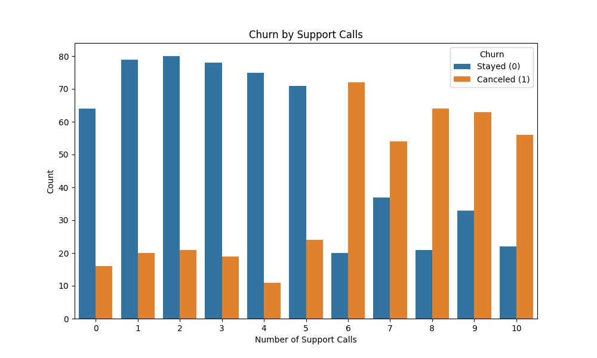

# SaaS Churn Prediction Pro 🚀

Machine Learning model to predict customer churn in SaaS platforms.
Modelo de Machine Learning para prever cancelamento de clientes em plataformas SaaS.

---

## 🛠️ Stack / Tecnologias
- **Language**: Python 3.12+
- **Data Analysis**: Pandas
- **Machine Learning**: Scikit-Learn (RandomForestClassifier)
- **Visualization**: Seaborn, Matplotlib

---

## 📈 Results / Resultados
- **Accuracy / Acurácia**: 72.00%
- **Visualization / Visualização**:


---

## 🚀 How to Run / Como Rodar

### 1. Install Dependencies / Instalar Dependências
```bash
pip install -r requirements.txt
```

### 2. Predict Churn / Prever Churn
Run the inference script to test with example cases:
Execute o script de inferência para testar com casos de exemplo:
```bash
python src/predict_churn.py
```

---

## 📁 Project Structure / Estrutura do Projeto
- `data/raw/`: Churn dataset (CSV).
- `models/`: Trained model binaries (`.pkl`).
- `notebooks/`: Data visualizations and reports.
- `src/`: 
  - `initial_analysis.py`: Basic data inspection.
  - `visualize_data.py`: Chart generation.
  - `train_model.py`: Model training and evaluation.
  - `predict_churn.py`: Individual prediction script.

---

## English Description
This project aims to develop a predictive model to identify customers likely to cancel their SaaS subscriptions (churn). By analyzing historical usage data, it provides actionable insights to improve retention.

## Descrição em Português
Este projeto visa desenvolver um modelo preditivo para identificar clientes com probabilidade de cancelar suas assinaturas SaaS (churn). Ao analisar dados históricos de uso, o modelo fornece insights acionáveis para melhorar a retenção.
